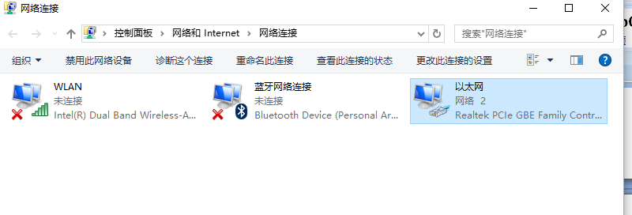
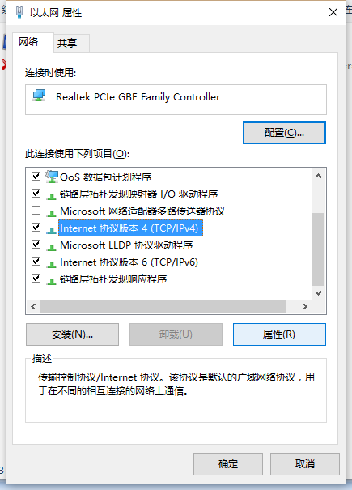
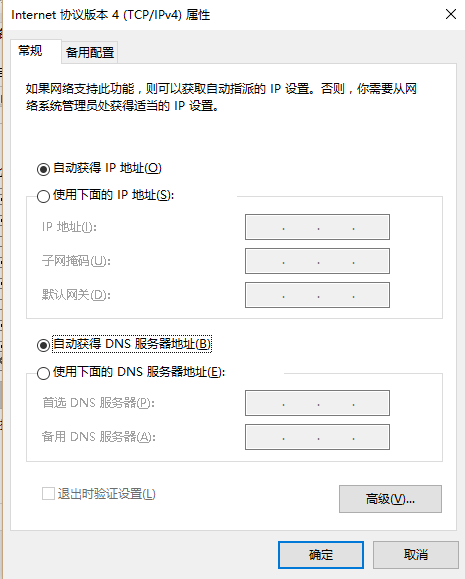
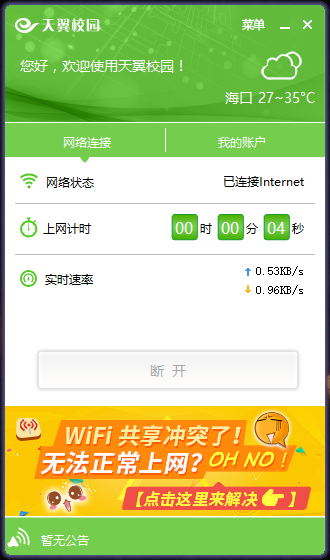

## 电信电脑端设置上网(Windows)

当你的电脑正确连接网线时，会直接弹出一个页面，若是没有弹出，则需要在设置中选择自动获取ip。

1. 打开网络与共享中心:打开电脑，右下角找到这样一个图标，右键一下，然后点击“打开网络和共享中心”。

2. 选择更改配置器设置:

   

3. 鼠标右键点击以太网选择 属性栏

   

4. 选择ipv4的属性

   

5. 随后点击自动获取IP和自动获取DNS即完成自动获取IP了

   

6. 在浏览器中访问[天翼客户端网址](http://zsteduapp.10000.gd.cn/index.html)。弹出页面后点击按钮（如下图）

   

7. 根据提示，下载与你的电脑系统对应的客户端程序。

   

8. 下载并安装，打开天翼校园，你将会看到这样的画面：

   

9. 正确输入你的账号密码就可以上网啦。

注意：电信为了保证用网质量的良好，关闭了常用的PPPoE上网方式，所以是不能设置路由器上网的，同时也是不能使用自带拨号软件等上网的，如果想要使用WIFI，可以连接覆盖全校的F-Young无线网络，请看下文，手机客户端的登录。

[上一条：电信电脑端上网前的准备](/guide/prepareDX)

[下一条：电信电脑端设置上网(macOS)](/guide/setMacDX)